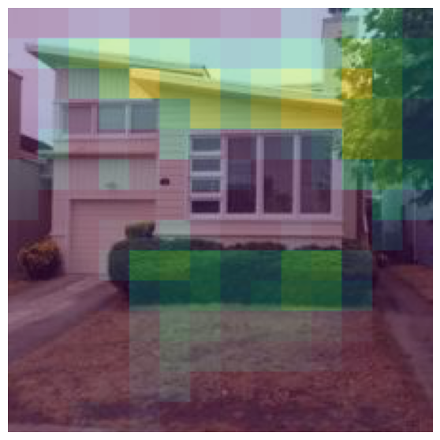
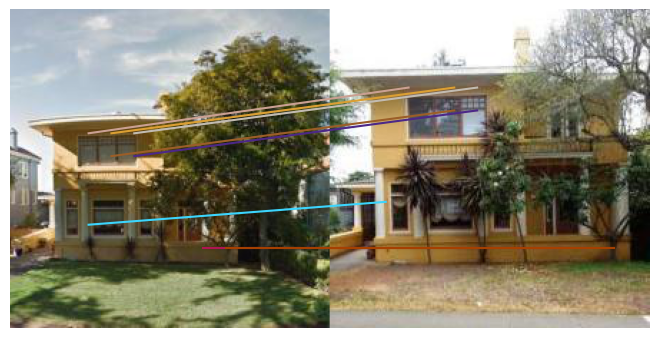

# AML Project - DELG implementation

## run_DELG.ipynb
In this branch of the repository we have all the code needed to run this implementation of the model.
This could be done by executing the run_DELG.ipynb notebook.

### Train

After downloading the sf-xs dataset, simply run 

`$ python3 AG/train.py --dataset_folder sf_xs --backbone resnet50 --groups_num 1 --epochs_num 3 --fm_reduction_dim 128 --reduction`

The script automatically saves the resulting object in the folder `cache`.
The training is performed with a ResNet-50 with global descriptors ofdimensionality 512 and local descriptors of dimensionality 128.

Run `$ python3 train.py -h` to have a look at all the hyperparameters and options you can change.

### Train ony the local features
By this command, you can train only the local features for the number of ecpochs you wish

`$ python3 AG/train_only_local.py --dataset_folder sf_xs --backbone resnet50 --groups_num 1 --epochs_num 3 --fm_reduction_dim 128 --reduction --resume_model /content/drive/MyDrive/best_model.pth`

### Test
You can test a trained model as such

`python3 AG/eval.py --dataset_folder sf_xs --backbone resnet50 --fc_output_dim 512 --fm_reduction_dim 128 --reduction --resume_model /content/drive/MyDrive/res50_bs32_red128_3+9.pth`

## Model 

Here we have the model that provides best performance

<table>
  <tr>
    <th colwspan=1>Model</th>
    <th></th>
    <th colspan=1>Dimension of global descriptors</th>
    <th colspan=1>Dimension of local descriptors</th>
    <th colspan=1>Joint-training epochs</th>
    <th colspan=1>Epochs of local descriptors training</th>
  </tr>
  <tr>
    <td>ResNet-50</td>
    <td><a href="https://drive.google.com/file/d/1RkYVkKBczq4jDCBcf5bwnlTDRo5i1QLb/view?usp=drive_link">link</a></td>
    <td>512</td>
    <td>128</td>
    <td>3</td>
    <td>9</td>
  </tr>
  <tr>
</table>

## utils_notebook.ipynb

By this notebook, several actions could be done. Once downloaded the model above, you can run the blocks of the notebook in order to: 
- Downloading the dataset.
- Extract specific query and image from the dataset by the index.
- Use the model to make inference on these images.
- Visualize the attention map as an heat map computed for a specific image by the model (you can also remove the comment to see and select the coordinates of the K highest keypoints from the attention map)

- Visualize the match between the features executed by RANSAC on a specific query and database image.

- Make the reranking on a specific query, visualizing also the change of position of each positive image with respect to the original order and obtaining a raw values of both recalls as a reference.
- Eventually download the output of the model for the whole validation set in order to execute the tuning of the parameters offline.
- Finetuning the parameters on the validation set online by choosing different value of K, the descriptor matching threshold and the ransac residual threshold. 

### Attention map example

### Matching example

## Author
Davide Aiello s303296